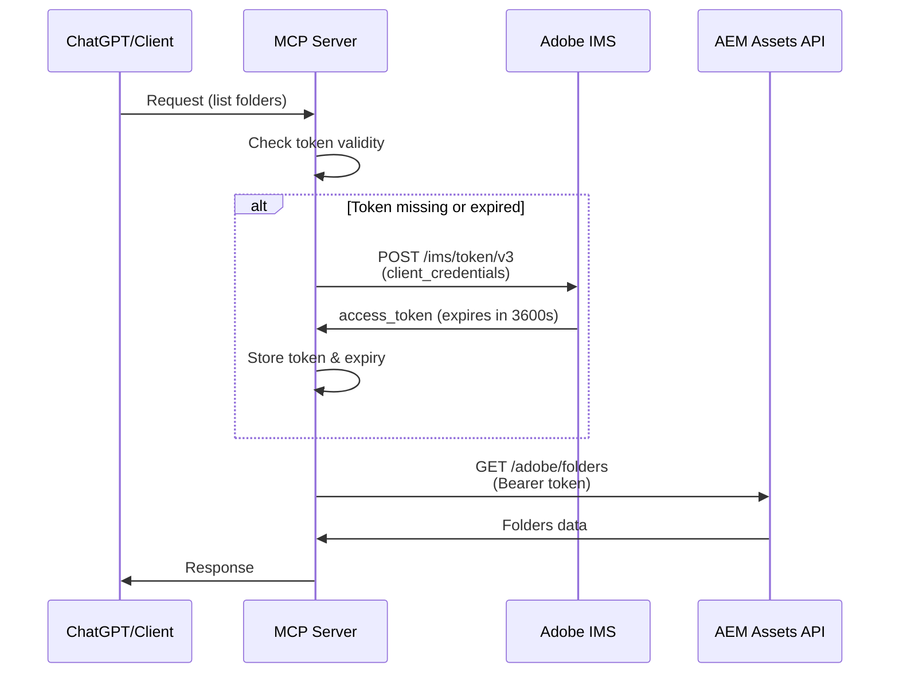

# ✅ OAuth Server-to-Server Setup Complete!

Your AEM Assets MCP Server now uses **OAuth Server-to-Server authentication** with automatic token refresh!

## 🎯 What Changed

### 1. **Automatic Token Management**
- ✅ Server automatically fetches access tokens from Adobe IMS
- ✅ Tokens refresh automatically before expiration (every ~1 hour)
- ✅ No manual token generation needed
- ✅ Based on [Adobe's OAuth S2S documentation](https://experienceleague.adobe.com/en/docs/experience-manager-learn/cloud-service/aem-apis/openapis/invoke-api-using-oauth-s2s)

### 2. **New Environment Variables**

**Before** (old manual token):
```env
AEM_BASE_URL=https://...
AEM_ACCESS_TOKEN=eyJhbGc...  # Manual token that expires
AEM_ORG_ID=xxxxx@AdobeOrg
AEM_CLIENT_ID=xxxxx
```

**After** (new OAuth):
```env
AEM_BASE_URL=https://author-p12345-e67890.adobeaemcloud.com
AEM_CLIENT_ID=your_client_id_here
AEM_CLIENT_SECRET=your_client_secret_here  # Get from Adobe Console
```

### 3. **What You Need to Do**

#### Step 1: Get Your Client Secret

You already have:
- ✅ AEM_BASE_URL: `https://author-p12345-e67890.adobeaemcloud.com`
- ✅ AEM_CLIENT_ID: `your_client_id_here`

You still need:
- ❓ **AEM_CLIENT_SECRET** - Get this from Adobe Developer Console

**How to get it:**
1. Go to [Adobe Developer Console](https://developer.adobe.com/console)
2. Select your project
3. Navigate to "OAuth Server-to-Server" credential
4. Click "Retrieve client secret"
5. Copy the secret

See detailed guide: [GET_CREDENTIALS.md](./GET_CREDENTIALS.md)

#### Step 2: Create/Update Your .env File

```bash
# Copy the example
cp env.example .env

# Edit with your values
nano .env
```

Fill in:
```env
AEM_BASE_URL=https://author-p12345-e67890.adobeaemcloud.com
AEM_CLIENT_ID=your_client_id_here
AEM_CLIENT_SECRET=your_client_secret_here
```

#### Step 3: Test Locally

```bash
# Activate virtual environment
source venv/bin/activate

# Run server
uvicorn app.main:app --reload
```

**Watch the logs** - you should see:
```
INFO:app.aem_client:Fetching new access token from Adobe IMS
INFO:app.aem_client:Access token obtained, expires in 3600 seconds
```

#### Step 4: Test API Call

```bash
curl -X POST http://localhost:8000/api/mcp \
  -H "Content-Type: application/json" \
  -d '{
    "tool": "list_folders",
    "arguments": {"path": "/"}
  }'
```

## 🔄 How Token Refresh Works



### Token Lifecycle

1. **First Request**: No token exists
   - Server fetches token from Adobe IMS
   - Token valid for ~1 hour (3600 seconds)
   - Stored in memory

2. **Subsequent Requests**: Token exists and valid
   - Server uses existing token
   - No additional IMS calls

3. **Token About to Expire**: 55 minutes passed
   - Server detects expiration approaching
   - Automatically fetches new token
   - Seamless for clients

4. **Token Expired**: After 1 hour
   - Server fetches new token before next request
   - No failed requests

## 📝 Updated Files

### Code Changes
- ✅ `app/aem_client.py` - Added OAuth token management
- ✅ `app/main.py` - Updated configuration
- ✅ `env.example` - New environment variables

### Configuration Changes
- ✅ `vercel.json` - Updated for new env vars
- ✅ `terraform/main.tf` - Updated secrets
- ✅ `terraform/variables.tf` - New variables
- ✅ `.github/workflows/*` - Updated for OAuth

### Documentation
- ✅ `GET_CREDENTIALS.md` - How to get OAuth credentials
- ✅ `OAUTH_SETUP_SUMMARY.md` - This file

## 🚀 Deployment Updates

### Vercel (Phase 1)

**Add these environment variables** in Vercel dashboard:

| Variable | Value |
|----------|-------|
| `AEM_BASE_URL` | `https://author-p12345-e67890.adobeaemcloud.com` |
| `AEM_CLIENT_ID` | `your_client_id_here` |
| `AEM_CLIENT_SECRET` | Your secret from Adobe Console |
| `ADOBE_IMS_TOKEN_ENDPOINT` | `https://ims-na1.adobelogin.com/ims/token/v3` |

Then redeploy:
```bash
vercel --prod
```

### Cloud Run (Phase 2)

**Update secrets in Google Secret Manager:**

```bash
# Update the client secret
echo -n "your_client_secret" | gcloud secrets versions add aem-client-secret --data-file=-

# Redeploy
gcloud run services update aem-assets-mcp-server \
  --region us-central1 \
  --set-env-vars="AEM_BASE_URL=https://author-p12345-e67890.adobeaemcloud.com,AEM_CLIENT_ID=your_client_id_here"
```

Or use Terraform:
```bash
cd terraform
nano terraform.tfvars  # Update values
terraform apply
```

## ✅ Benefits

### Before (Manual Token)
- ❌ Token expires every hour
- ❌ Manual token generation needed
- ❌ Service interruption when token expires
- ❌ Need to update .env every hour
- ❌ Complex token refresh logic needed

### After (OAuth S2S)
- ✅ Automatic token refresh
- ✅ No service interruption
- ✅ Set once, works forever
- ✅ Server handles everything
- ✅ Production-ready authentication

## 🔒 Security Notes

1. **Client Secret is Sensitive**
   - Never commit to Git
   - Use Secret Manager in production
   - Rotate every 90 days

2. **Scopes Define Permissions**
   - Only include necessary scopes
   - Review in Adobe Developer Console
   - Match with Product Profile

3. **Token Storage**
   - Stored in server memory
   - Not persisted to disk
   - Refreshed automatically

## 🐛 Troubleshooting

### "Missing required environment variable: AEM_CLIENT_SECRET"

**Solution**: Add client secret to .env file

### "Failed to authenticate with Adobe IMS: 401"

**Solution**: 
1. Verify CLIENT_SECRET is correct
2. Check CLIENT_ID matches Adobe Console
3. Ensure scopes are correctly formatted (comma-separated, no spaces)

### "Access token obtained, but API calls fail with 401"

**Solution**:
1. Check Product Profile is assigned in Adobe Console
2. Verify AEM_BASE_URL is correct
3. Ensure API endpoint is correct: `/adobe/assets`

### Token not refreshing

**Solution**: Check server logs for errors. Token should refresh automatically when:
- First request is made
- Token is expired or missing
- Token expires in < 5 minutes

## 📚 Additional Resources

- [GET_CREDENTIALS.md](./GET_CREDENTIALS.md) - Detailed credential guide
- [Adobe OAuth S2S Docs](https://experienceleague.adobe.com/en/docs/experience-manager-learn/cloud-service/aem-apis/openapis/invoke-api-using-oauth-s2s)
- [AEM Assets API Docs](https://developer.adobe.com/experience-cloud/experience-manager-apis/api/stable/assets/author/)

## 🎉 Next Steps

1. ✅ Get your CLIENT_SECRET from Adobe Console
2. ✅ Update your .env file
3. ✅ Test locally
4. ✅ Deploy to Vercel or Cloud Run
5. ✅ Integrate with ChatGPT

Your MCP server is now production-ready with automatic token management! 🚀
